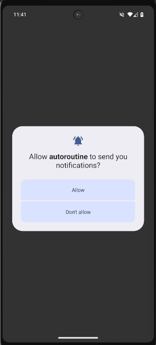
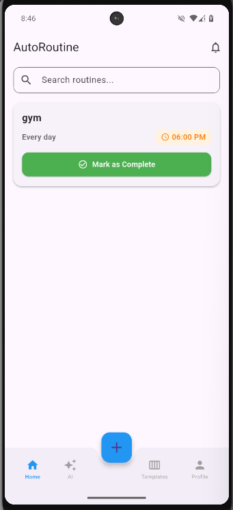
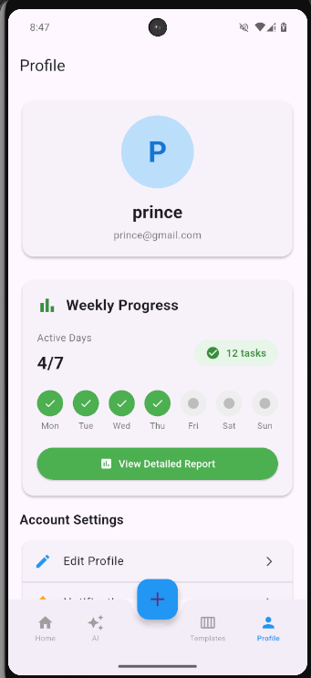
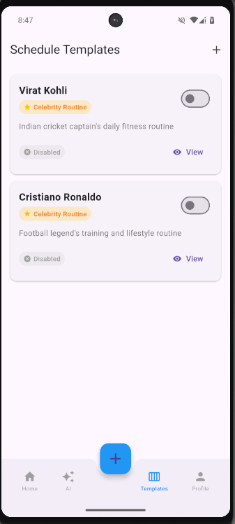
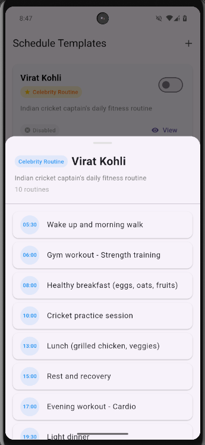

# AutoRoutine

<div align="center">
  
</div>
</br>
A comprehensive Flutter application for managing daily routines with AI-powered scheduling, smart notifications, celebrity wellness templates, and activity tracking. Built with flutter_bloc for state management, Supabase for backend, and Google Gemini AI for conversational routine creation.

## 🎯 Overview

AutoRoutine helps users build and maintain consistent daily habits through:
- **Conversational AI Routine Builder**: Chat-based interface to create routines naturally
- **Smart Notifications**: 5-minute pre-reminders, task-time alerts, and 10 PM nightly summaries
- **Celebrity Wellness Templates**: Predefined routines from Virat Kohli and Cristiano Ronaldo
- **Template System**: Create, activate, and switch between routine collections
- **Activity Tracking**: Complete tasks with visual feedback and weekly progress reports
- **Bottom Navigation**: Seamless access to Home, AI Generator, Templates, and Profile

## 🛠 Tech Stack

### Frontend
| Technology | Version | Purpose |
|------------|---------|----------|
|  | ^3.10.1 | Cross-platform mobile framework |
|  | ^3.10.1 | Programming language |
|  | Latest | State management (Cubit pattern) |
|  | Latest | UI design system |

### Backend & Services
| Technology | Version | Purpose |
|------------|---------|----------|
|  | Latest | Backend-as-a-Service (Auth, PostgreSQL, RLS) |
|  | Latest | Relational database |
|  | Latest | AI routine generation |

### Notifications & Scheduling
| Technology | Version | Purpose |
|------------|---------|----------|
|  | ^17.1.2 | Native push notifications |
|  | ^0.9.2 | Timezone management |
|  | ^5.0.1 | Device timezone detection |

### Additional Libraries
| Technology | Version | Purpose |
|------------|---------|----------|
|  | ^2.0.7 | Value equality |
|  | ^0.19.0 | Internationalization |
|  | Latest | Environment configuration |

### Frontend
- **Flutter** (SDK ^3.10.1)
- **State Management**: flutter_bloc + Cubit pattern
- **UI Components**: Material Design with custom cards, chips, and animations

### Backend
- **Supabase**: Authentication, PostgreSQL database, Row Level Security
- **Google Gemini API**: Natural language routine generation

### Notifications
- **flutter_local_notifications**: Platform-specific notification scheduling
- **timezone**: Time zone aware scheduling with repeat patterns

### Dependencies
```yaml
flutter_bloc, supabase_flutter, equatable, flutter_dotenv
google_generative_ai, intl, flutter_local_notifications
timezone, flutter_timezone
```

## ✨ Features

### 🔐 Authentication
- Email/password authentication via Supabase Auth
- Secure session management with RLS policies
- Splash screen with automatic login detection

### 🤖 AI-Powered Chatbot Interface
- **Conversational routine creation**: Natural chat flow instead of forms
- **Step-by-step guidance**: Task name → Frequency → Time → Category
- **Specific-days selection**: Choose exact days with visual day picker
- **Smart frequency options**: Daily, Specific days (Mon-Sun), Custom frequency
- **Real-time feedback**: Bot responses guide you through each step

### 🔔 Smart Notification System
- **5-minute pre-reminders**: Get ready before task time
- **Task-time notifications**: Non-dismissible alerts with action buttons
  - ✅ **Completed**: Mark task done, cancel all reminders
  - ❌ **Dismiss**: Mark incomplete, keep reminders active
- **10 PM nightly reminder**: Summary of incomplete tasks
- **Day-specific scheduling**: Respects chosen days for weekly routines
- **Automatic sync**: Updates on routine add/edit/delete/complete

### 🌟 Celebrity Wellness Templates
- **Virat Kohli's Routine**: 10 wellness tasks (meditation, yoga, training, etc.)
- **Cristiano Ronaldo's Routine**: 11 fitness-focused tasks
- **One-tap activation**: Toggle templates on/off from template list
- **Badge indicators**: Star badges show celebrity templates
- **View details modal**: See full routine before activating

### 📋 Template Management
- **Create templates**: Save routine collections with custom names
- **Activate/Deactivate**: Toggle templates on home screen
- **Category organization**: Personal templates with custom categories
- **Delete protection**: Only personal templates can be deleted
- **Template routines**: Activated templates appear on home screen

### 🏠 Home Screen
- **Search functionality**: Filter routines by name, frequency, or template
- **Task cards**: Enhanced design with:
  - Template name badge (blue)
  - Task name (bold)
  - Frequency and time display (orange badge)
  - Mark complete/incomplete button
  - Dismiss (X) button in top-right
- **Visual completion tracking**: Green border, strikethrough text
- **Notification icon**: Access notifications (future: show count)

### 📊 Profile Screen
- **Weekly progress report**: Tasks completed this week
- **User information**: Display email and profile data
- **Activity insights**: Track routine consistency

### 🎨 Navigation
- **Bottom Navigation Bar**: 5 tabs with icons
  1. 🏠 Home
  2. ✨ AI Generator
  3. 📋 Templates
  4. 👤 Profile
  5. (Center FAB for quick add)
- **FloatingActionButton**: Quick access to manual routine creation
- **State preservation**: IndexedStack keeps tab state

##  App Screenshots

<div align="center">
  
  
  
  
</div>
<div align="center">
 
  
</div>

## �📁 Project Architecture

```
lib/
├── main.dart                          # App entry, MultiBlocProvider setup
├── core/
│   ├── constants/                     # App-wide constants
│   ├── errors/                        # Custom error classes
│   ├── presentation/
│   │   └── splash_screen.dart         # Initial loading screen
│   └── utils/
│       └── notification_service.dart  # Notification scheduling logic
│
├── features/
│   ├── auth/
│   │   ├── cubit/
│   │   │   ├── auth_cubit.dart        # Authentication state management
│   │   │   └── auth_state.dart
│   │   └── presentation/
│   │       └── auth_gate.dart         # Login/Signup UI
│   │
│   ├── home/
│   │   └── presentation/
│   │       ├── home_screen.dart       # Routine list with search
│   │       └── main_navigation_screen.dart  # Bottom nav container
│   │
│   └── routines/
│       ├── cubit/
│       │   ├── routine_cubit.dart            # Routine CRUD operations
│       │   ├── routine_state.dart
│       │   ├── template_cubit.dart           # Template state management
│       │   ├── template_state.dart
│       │   ├── routine_suggest_cubit.dart    # AI suggestions
│       │   ├── add_routine_cubit.dart        # Manual routine form state
│       │   └── add_routine_state.dart
│       │
│       ├── data/
│       │   ├── routine_model.dart            # Routine domain model
│       │   ├── routine_repository.dart       # Supabase CRUD
│       │   ├── template_model.dart           # Template domain model
│       │   ├── template_repository.dart      # Template CRUD
│       │   ├── celebrity_routines.dart       # Predefined templates
│       │   └── activity_repository.dart      # Activity tracking
│       │
│       ├── domain/
│       │   ├── enums.dart                    # ScheduleFrequency, TaskType, DayOfWeek
│       │   └── add_routine_model.dart        # Form data model
│       │
│       └── presentation/
│           ├── add_routine_screen.dart       # 5-step manual routine creation
│           ├── ai_routine_generator_screen.dart  # Chatbot UI
│           ├── template_list_screen.dart     # Browse and activate templates
│           ├── create_template_screen.dart   # Save new template
│           ├── suggest_routine_screen.dart   # AI-suggested routines
│           ├── profile_screen.dart           # User profile and stats
│           └── widgets/
│               └── add_routine_widgets.dart  # Reusable form components
│
android/
├── app/src/main/AndroidManifest.xml   # Notification permissions
│
ios/
└── Runner/Info.plist                   # iOS notification permissions
```

## 🗄 Database Schema

### `routine` table
```sql
create table public.routine (
  id uuid primary key default gen_random_uuid(),
  user_id uuid not null references auth.users (id),
  hour int not null,
  min int not null,
  message text not null,
  is_active boolean not null default true,
  schedule_type text default 'General',
  schedule_frequency text default 'Every day',
  template_name text,
  is_completed boolean default false,
  task_type text default 'routine',
  created_at timestamp with time zone default now()
);
```

### `routine_template` table
```sql
create table public.routine_template (
  id uuid primary key default gen_random_uuid(),
  user_id uuid not null references auth.users (id),
  name text not null,
  description text,
  schedule_type text default 'General',
  is_active boolean default false,
  category text,
  is_predefined boolean default false,
  created_at timestamp with time zone default now(),
  updated_at timestamp with time zone default now()
);
```

### `template_routine` table
```sql
create table public.template_routine (
  id uuid primary key default gen_random_uuid(),
  template_id uuid not null references public.routine_template (id) on delete cascade,
  hour int not null,
  min int not null,
  message text not null,
  is_active boolean not null default true
);
```

### `activity_log` table
```sql
create table public.activity_log (
  id uuid primary key default gen_random_uuid(),
  user_id uuid not null references auth.users (id),
  routine_id uuid references public.routine (id),
  task_name text not null,
  completed_at timestamp with time zone default now()
);
```

## 🚀 Getting Started

### Prerequisites
- Flutter SDK ^3.10.1
- Android Studio / Xcode for mobile development
- Supabase account (free tier available)
- Google Gemini API key (free tier: 1500 requests/day)

### Installation

1. **Clone the repository**
```bash
git clone <repo-url>
cd autoroutine
flutter pub get
```

2. **Environment Configuration**

Create a `.env` file in the project root:
```env
SUPABASE_URL=https://<your-project>.supabase.co
SUPABASE_ANON_KEY=<your-anon-key>
GEMINI_API_KEY=<your-gemini-api-key>
```

**Get API Keys:**
- **Supabase**: [https://supabase.com](https://supabase.com) → Create project → API settings
- **Gemini**: [https://ai.google.dev](https://ai.google.dev) → Get API key (no billing required)

3. **Supabase Database Setup**

Run these SQL commands in Supabase SQL Editor:

```sql
-- Create routine table
create table public.routine (
  id uuid primary key default gen_random_uuid(),
  user_id uuid not null references auth.users (id),
  hour int not null,
  min int not null,
  message text not null,
  is_active boolean not null default true,
  schedule_type text default 'General',
  schedule_frequency text default 'Every day',
  template_name text,
  is_completed boolean default false,
  task_type text default 'routine',
  created_at timestamp with time zone default now()
);

-- Create template table
create table public.routine_template (
  id uuid primary key default gen_random_uuid(),
  user_id uuid not null references auth.users (id),
  name text not null,
  description text,
  schedule_type text default 'General',
  is_active boolean default false,
  category text,
  is_predefined boolean default false,
  created_at timestamp with time zone default now(),
  updated_at timestamp with time zone default now()
);

-- Create template_routine table
create table public.template_routine (
  id uuid primary key default gen_random_uuid(),
  template_id uuid not null references public.routine_template (id) on delete cascade,
  hour int not null,
  min int not null,
  message text not null,
  is_active boolean not null default true
);

-- Create activity_log table
create table public.activity_log (
  id uuid primary key default gen_random_uuid(),
  user_id uuid not null references auth.users (id),
  routine_id uuid references public.routine (id),
  task_name text not null,
  completed_at timestamp with time zone default now()
);

-- Enable Row Level Security
alter table public.routine enable row level security;
alter table public.activity_log enable row level security;
alter table public.routine_template enable row level security;
alter table public.template_routine enable row level security;

-- Routine policies
create policy "Select own routines" on public.routine
for select using (auth.uid() = user_id);

create policy "Insert own routines" on public.routine
for insert with check (auth.uid() = user_id);

create policy "Update own routines" on public.routine
for update using (auth.uid() = user_id);

create policy "Delete own routines" on public.routine
for delete using (auth.uid() = user_id);

-- Activity log policies
create policy "Select own activity" on public.activity_log
for select using (auth.uid() = user_id);

create policy "Insert own activity" on public.activity_log
for insert with check (auth.uid() = user_id);

-- Template policies
create policy "Select own templates" on public.routine_template
for select using (auth.uid() = user_id);

create policy "Insert own templates" on public.routine_template
for insert with check (auth.uid() = user_id);

create policy "Update own templates" on public.routine_template
for update using (auth.uid() = user_id);

create policy "Delete own templates" on public.routine_template
for delete using (auth.uid() = user_id);

-- Template routine policies
create policy "All on template_routine via template" on public.template_routine
for all using (
  template_id in (select id from public.routine_template where user_id = auth.uid())
);
```

4. **Android Notification Setup**

Ensure `android/app/src/main/AndroidManifest.xml` has:
```xml
<uses-permission android:name="android.permission.POST_NOTIFICATIONS" />
<uses-permission android:name="android.permission.SCHEDULE_EXACT_ALARM" />
<uses-permission android:name="android.permission.USE_EXACT_ALARM" />
```

5. **Run the App**
```bash
flutter run
```

## 👤 User Workflow

### First Time User Journey

1. **Welcome & Authentication**
   - Open app → Splash screen loads
   - Sign up with email/password
   - Auto-redirect to Home screen

2. **Explore Celebrity Templates**
   - Tap **Templates** tab (bottom nav)
   - See Virat Kohli and Cristiano Ronaldo routines
   - Tap **View Details** to preview tasks
   - Toggle **Activate** switch
   - Return to **Home** → See template tasks appear

3. **Create First Custom Routine (AI)**
   - Tap **AI Generator** tab
   - Chat with bot: "Morning workout at 6 AM"
   - Select **Daily** frequency
   - Choose time with time picker
   - Select **Personal** category
   - Review and confirm
   - Return to Home → See new routine

4. **Create Routine (Manual)**
   - Tap center **FAB** (+ button)
   - Follow 5-step wizard:
     1. Enter task name
     2. Choose frequency (Daily/Specific days/Custom)
     3. Select time and days (if applicable)
     4. Choose task type
     5. Review and save
   - Routine appears on Home

5. **Manage Routines**
   - **Complete task**: Tap green "Mark as Complete" button
   - **Undo completion**: Tap grey "Mark as Incomplete" button
   - **Dismiss task**: Tap X icon (top-right of card)
   - **Search**: Use search bar to filter routines

6. **Receive Notifications**
   - **5 minutes before**: "Upcoming in 5 minutes - Get ready for Morning workout"
   - **At task time**: "Time for Morning workout - Tap Completed or Dismiss"
     - Tap **Completed** → Task marked done, notifications cancelled
     - Tap **Dismiss** → Task stays active, notifications continue
   - **10 PM nightly**: "Incomplete task reminder - Morning workout is still incomplete"

7. **View Progress**
   - Tap **Profile** tab
   - See weekly completion count
   - View user email and stats

### Returning User Flow

1. **Open app** → Auto-login → Home screen with all routines
2. **Check search** → Filter by task name
3. **Activate/Deactivate templates** as needed
4. **Mark tasks complete** throughout the day
5. **Respond to notifications** with action buttons
6. **Create new routines** via AI or manual entry

## 🎨 UI/UX Highlights

### Design System
- **Material Design 3** components
- **Custom color scheme**: Blue primary, Orange accents, Green success
- **Card-based layouts**: Elevated cards with rounded corners
- **Filter chips**: Category selection with visual feedback
- **Bottom sheets**: Template details modal
- **Snackbars**: User feedback with bottom margin for FAB

### Animations
- **Page transitions**: Smooth navigation between tabs
- **Button ripples**: Material ink effects
- **Hero animations**: FAB with unique hero tags
- **Scroll physics**: Natural scrolling with bounce

### Responsive Design
- **Adaptive layouts**: Single-scroll pages with flexible heights
- **Safe areas**: Proper padding for notches and navigation bars
- **Keyboard handling**: TextField focus and scroll adjustments

## 🔔 Notification System Details

### Scheduling Logic
- **Daily routines**: Repeat every day at specified time
- **Specific-days routines**: Parse days from `schedule_frequency` (e.g., "Specific days (Mon, Wed, Fri)")
- **Pre-reminders**: Schedule 5 minutes before main time
- **Nightly summary**: Fixed 10 PM daily check for incomplete tasks

### Notification Actions
```dart
// Android notification with action buttons
AndroidNotificationDetails(
  ongoing: true,  // Non-dismissible for task-time alerts
  autoCancel: false,
  actions: [
    AndroidNotificationAction('action_complete', 'Completed'),
    AndroidNotificationAction('action_dismiss', 'Dismiss'),
  ],
)
```

### Notification IDs
- Unique ID generation: `routineId.hashCode + typeOffset + (weekday * 10)`
- Types: `pre`, `time`, `night`, `pre-{weekday}`, `time-{weekday}`
- Ensures no ID collisions for weekly routines

### Sync Events
Notifications sync automatically on:
- App launch (via `NotificationService.initialize()`)
- Routine creation/edit/delete
- Task completion toggle
- Template activation/deactivation

## 🧪 Testing Notifications

1. **Test pre-reminder**: Create routine 6 minutes from now → Wait for 5-min alert
2. **Test task-time**: Create routine at current time + 1 min → Check ongoing notification
3. **Test actions**: Tap "Completed" → Verify task marked done, notifications cancelled
4. **Test nightly**: Wait until 10 PM → Check incomplete task reminder
5. **Test specific days**: Create Mon/Wed routine → Verify only schedules on those days

## 🏗 State Management Pattern

### BLoC/Cubit Architecture

The app uses **flutter_bloc** with the **Cubit pattern** for predictable state management:

```dart
// State flow example: RoutineCubit
RoutineInitial → emit(RoutineLoading) → 
  Success: emit(RoutineLoaded(routines)) | 
  Failure: emit(RoutineError(message))
```

**Key Cubits:**
- `AuthCubit`: Login/logout, session management
- `RoutineCubit`: CRUD operations, completion toggle, delete
- `TemplateCubit`: Template CRUD, activation (local state for celebrity templates)
- `AddRoutineCubit`: Multi-step form state for manual routine creation
- `RoutineSuggestCubit`: AI-generated suggestions

**Provider Setup** (main.dart):
```dart
MultiBlocProvider(
  providers: [
    BlocProvider(create: (_) => AuthCubit()),
    BlocProvider(create: (_) => RoutineCubit(RoutineRepository())),
    BlocProvider(create: (_) => TemplateCubit(TemplateRepository())),
    BlocProvider(create: (_) => RoutineSuggestCubit(ActivityRepository())),
  ],
  child: MaterialApp(...),
)
```

### Repository Pattern

Separation of business logic (Cubit) and data access (Repository):

```dart
class RoutineRepository {
  final SupabaseClient _client = Supabase.instance.client;
  
  Future<List<Routine>> fetchRoutine() async {
    // Fetch user routines + active template routines
    // Merge and return combined list
  }
  
  Future<void> addRoutine({...}) async {
    // Insert into Supabase
  }
  
  Future<void> toggleRoutineCompletion(String id, bool completed) async {
    // Update is_completed field
  }
  
  Future<void> deleteRoutine(String id) async {
    // Delete from database
  }
}
```

## 🔐 Security & Data Privacy

### Row Level Security (RLS)

All database tables use Supabase RLS to ensure users only access their own data:

```sql
-- Example: Users can only see their own routines
create policy "Select own routines" on public.routine
for select using (auth.uid() = user_id);
```

**Protected Operations:**
- ✅ Users can read/write/delete only their own routines
- ✅ Templates are scoped to creator's user_id
- ✅ Activity logs are private per user
- ❌ No cross-user data access possible

### Authentication Flow

1. User signs up/logs in → Supabase Auth creates session
2. Session token stored securely by Supabase SDK
3. All API requests include auth header automatically
4. RLS policies validate user_id on every query
5. Logout clears session and redirects to auth screen

## 🎯 Key Technical Decisions

### Why Chatbot UI for AI Generator?
**Problem**: Multi-step forms feel tedious and impersonal.  
**Solution**: Conversational interface makes routine creation feel natural and engaging.  
**Implementation**: Step-based state machine with chat message bubbles.

### Why Local State for Celebrity Templates?
**Problem**: Storing celebrity templates in DB causes UUID validation errors.  
**Solution**: Use non-UUID IDs (e.g., `celebrity_virat_kohli`) and track activation in `TemplateCubit._celebrityTemplateActivation` map.  
**Trade-off**: Activation state lost on app restart (acceptable for demo templates).

### Why Ongoing Notifications?
**Problem**: Users can swipe away important task reminders.  
**Solution**: Android `ongoing: true` makes notifications non-dismissible until action taken.  
**User Control**: "Completed" or "Dismiss" actions provide explicit choice.

### Why Separate `template_routine` Table?
**Problem**: Templates need to store routine definitions without creating actual routines.  
**Solution**: `template_routine` acts as a blueprint; actual routines created on activation.  
**Benefit**: Templates can be edited without affecting user's active routines.

## 📊 Data Flow Diagrams

### Creating a Routine (AI)
```
User Input (Chat) 
  → AI Generator validates step
  → Bot response guides next step
  → User completes all steps
  → Cubit.addRoutine() called
  → Repository.addRoutine() inserts to DB
  → NotificationService.syncRoutineNotifications() schedules alerts
  → Cubit.loadRoutines() refreshes UI
  → Home screen shows new routine
```

### Activating a Template
```
User taps "Activate" toggle
  → TemplateCubit.toggleTemplateActivation() called
  → If celebrity: Update local map, rebuild UI
  → If personal: Repository.updateTemplate(is_active=true)
  → Home screen re-fetches routines
  → RoutineRepository.fetchRoutine() merges template routines
  → Template tasks appear with blue badge
```

### Completing a Task
```
User taps "Mark as Complete"
  → RoutineCubit.toggleRoutineCompletion() called
  → Repository updates is_completed = true
  → NotificationService.cancelAllForRoutine() removes alerts
  → Cubit.loadRoutines() refreshes
  → Card shows green border + strikethrough
```

## 🛠 Troubleshooting

### Common Issues

**"Column minute" error**
- **Cause**: Database uses `min`, but some code references `minute`
- **Fix**: Ensure all queries use `min` for database column name

**RLS Policy Errors**
- **Cause**: Policies not created or PostgREST cache stale
- **Fix**: Run SQL policies, then notify PostgREST: `notify pgrst, 'reload schema';`

**Notifications Not Appearing**
- **Cause**: Permissions not granted or time zone misconfigured
- **Fix**: Check Android Settings → Apps → AutoRoutine → Notifications → Allowed

**Celebrity Templates Won't Activate**
- **Cause**: UUID validation error if trying to save to database
- **Fix**: TemplateCubit checks for non-UUID IDs and uses local state

**Hero Tag Errors**
- **Cause**: Multiple FloatingActionButtons with same default tag
- **Fix**: All FABs now have unique `heroTag` property

**Gemini API Quota Exceeded**
- **Cause**: 1500 requests/day limit reached
- **Fix**: Wait 24 hours or upgrade to paid tier

### Debug Mode

Enable Flutter DevTools for:
- **BLoC Inspector**: See state transitions in real-time
- **Network Inspector**: View Supabase API calls
- **Performance Overlay**: Check frame rates and rebuilds

```bash
flutter run --dart-define=DEBUG_MODE=true
```

## 🚧 Known Limitations

1. **iOS Notifications**: Cannot be truly non-dismissible (platform limitation)
2. **Celebrity Template State**: Lost on app restart (by design, easy to re-activate)
3. **Offline Mode**: Requires internet for Supabase operations
4. **Time Zone Changes**: User must restart app to update notification times
5. **Bulk Operations**: No multi-select for delete/complete (planned feature)

## 🔮 Future Enhancements

### Planned Features
- [ ] Push notifications via Firebase Cloud Messaging
- [ ] Routine streaks and gamification (badges, points)
- [ ] Social features (share templates with friends)
- [ ] Habit analytics dashboard with charts
- [ ] Voice input for AI routine creation
- [ ] Widget support for quick task completion
- [ ] Dark mode theme
- [ ] Multi-language support (i18n)
- [ ] Export routines to calendar (iCal format)
- [ ] Backup and restore to cloud storage

### Technical Improvements
- [ ] Offline-first architecture with local SQLite cache
- [ ] Unit tests for Cubits and Repositories
- [ ] Widget tests for critical user flows
- [ ] Integration tests with Supabase test environment
- [ ] CI/CD pipeline with GitHub Actions
- [ ] Crashlytics integration for error tracking
- [ ] Performance monitoring and analytics

## 🤝 Contributing

We welcome contributions! Here's how to get started:

### Development Workflow

1. **Fork the repository**
2. **Create a feature branch**: `git checkout -b feature/amazing-feature`
3. **Make your changes**
4. **Test thoroughly**: Ensure no regressions
5. **Commit with clear messages**: `git commit -m "Add: Amazing feature description"`
6. **Push to your fork**: `git push origin feature/amazing-feature`
7. **Open a Pull Request**

### Coding Standards

- **Dart Style**: Follow [Effective Dart](https://dart.dev/guides/language/effective-dart) guidelines
- **File Naming**: Use `snake_case` for files, `PascalCase` for classes
- **Comments**: Document public APIs and complex logic
- **State Management**: Use Cubit pattern, avoid setState in large widgets
- **Error Handling**: Always wrap async calls in try-catch

### Commit Message Format
```
Type: Brief description (50 chars max)

Detailed explanation if needed (wrap at 72 chars)

Closes #123
```

**Types**: `Add`, `Fix`, `Update`, `Refactor`, `Docs`, `Test`, `Chore`

## 📄 License

This project is open-source and available under the MIT License.

## 🙏 Acknowledgments

- **Flutter Team**: For the amazing cross-platform framework
- **Supabase**: For the powerful backend-as-a-service
- **Google Gemini**: For the conversational AI capabilities
- **Community Contributors**: For feedback and improvements

## 📞 Support

- **Issues**: [GitHub Issues](https://github.com/your-repo/autoroutine/issues)
- **Discussions**: [GitHub Discussions](https://github.com/your-repo/autoroutine/discussions)
- **Email**: souvikmandals10@gmail.com

---

**Open for Collabration with Open Source Communities ❤️**

*Last updated: January 31, 2026*